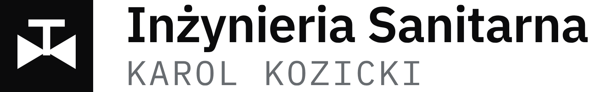
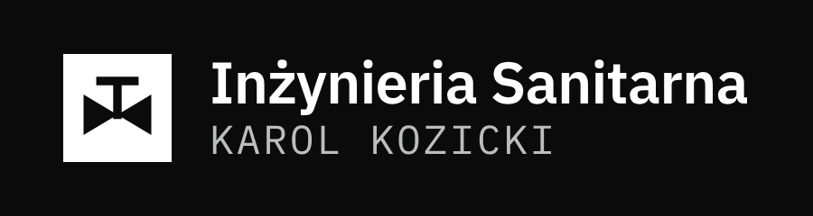
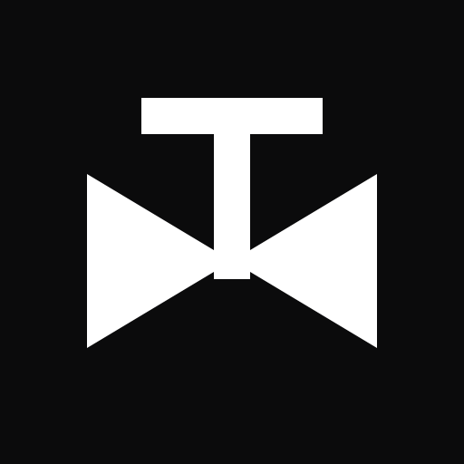
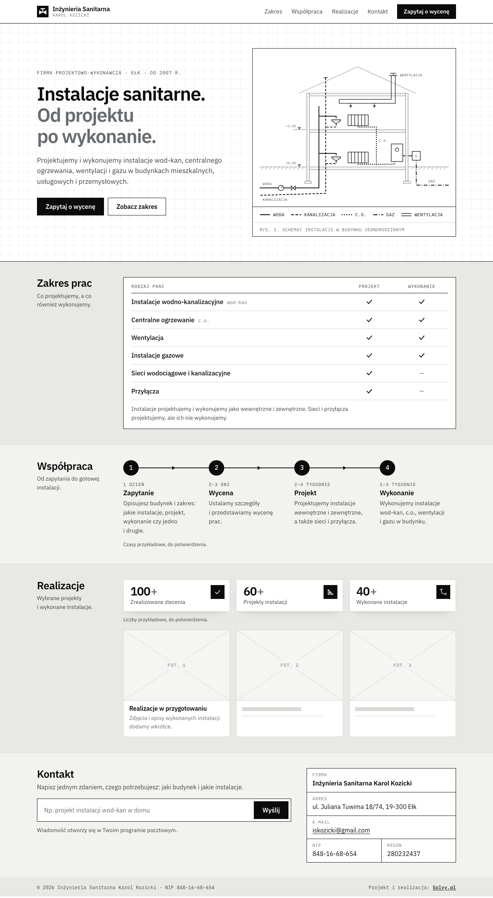

	<picture>
		<source media="(prefers-color-scheme: dark)" srcset="logo/logo-odwrocone.svg" />
		
	</picture>

# Strona firmowa: Inżynieria Sanitarna Karol Kozicki

Strona internetowa i logo dla firmy projektowo-wykonawczej z Ełku. Projekt i realizacja: [Solvy.pl](https://solvy.pl).

**Podgląd strony:** https://dmindabrowski.github.io/instalacje-sanitarne-karol-kozicki/

Podgląd odświeża się sam po każdej zmianie wysłanej do tego repozytorium. To wersja robocza: część danych jest przykładowa (lista niżej), a wyszukiwarki jej nie indeksują.

## Klient

Inżynieria Sanitarna Karol Kozicki działa w Ełku od 2007 roku. Projektuje i wykonuje instalacje wodno-kanalizacyjne, centralnego ogrzewania, wentylacji i gazu w budynkach jednorodzinnych, wielorodzinnych, usługowych i przemysłowych. Projektuje także sieci wodociągowe i kanalizacyjne oraz przyłącza, ale ich nie wykonuje.

Firma nie miała wcześniej strony ani logo. Jedyna wskazówka co do wyglądu brzmiała: czarno-biało.

## Co zrobiliśmy

### Logo

Znak to symbol zaworu z rysunku instalacji: dwa trójkąty stykające się wierzchołkami, a nad nimi trzpień z pokrętłem. Taki symbol stoi na każdym projekcie instalacji, więc od razu mówi, czym firma się zajmuje. Jest biały na czarnym kwadracie i pozostaje czytelny nawet jako ikona 16 × 16 pikseli.

Obok znaku stoi nazwa firmy (pismo IBM Plex Sans) i nazwisko właściciela wersalikami (IBM Plex Mono, pismo jak z opisów rysunku technicznego).

| Na jasnym tle | Na ciemnym tle | Sam znak |
| --- | --- | --- |
|  |  |  |

- **Kolory:** tylko czerń `#0B0B0C`, biel `#FFFFFF` i szarość `#686C70` dla nazwiska. Nie ma koloru firmowego.
- **Wersje:** logo podstawowe, logo odwrócone na ciemne tło i sam znak do ikon i profili.
- **Pliki:** SVG do druku i PNG do dokumentów, w katalogu [`logo/`](logo/). Napis jest zamieniony na krzywe, więc do drukarni nie trzeba dołączać fontu.

Pełny opis logo, z polem ochronnym, najmniejszymi rozmiarami i zasadami użycia: [logo/README.md](logo/README.md). To samo w jednym pliku dla klienta: [księga znaku (PDF, 6 stron)](logo/Inzynieria-Sanitarna-ksiega-znaku.pdf).

### Strona

Jedna strona, czarno-biała, z motywami rysunku technicznego. Działa na telefonie i komputerze, w trybie jasnym i ciemnym.

- **Nagłówek:** hasło „Instalacje sanitarne. Od projektu po wykonanie." i narysowany dla tej strony przekrój domu z instalacjami. Każda branża ma na nim własny typ linii, jak na prawdziwym rysunku.
- **Zakres prac:** tabela, która pokazuje, co firma projektuje, a co również wykonuje.
- **Współpraca:** cztery etapy od zapytania do wykonania instalacji.
- **Realizacje:** liczby zrealizowanych zleceń i miejsce na zdjęcia.
- **Kontakt:** pole na jedno zdanie, które otwiera gotową wiadomość e-mail, oraz dane firmy.

W teście Google Lighthouse z 6 października 2026 r. strona główna uzyskała 100 na 100 punktów w każdej z czterech kategorii: szybkość, dostępność, dobre praktyki i SEO.

## Co zostało do zrobienia

Zanim strona trafi pod docelowy adres, potrzebujemy od klienta:

- [ ] **Telefonu.** Po dopisaniu pojawi się w nagłówku i w sekcji Kontakt.
- [ ] **Potwierdzenia danych firmy.** Adres, e-mail, NIP i REGON pochodzą z publicznego rejestru CEIDG.
- [ ] **Liczby zleceń.** Wartości 100+, 60+ i 40+ są przykładowe i tak są podpisane na stronie.
- [ ] **Czasów realizacji** w sekcji Współpraca. Obecne też są przykładowe i podpisane.
- [ ] **Zdjęć i opisów realizacji.** Do tego czasu sekcja pokazuje puste ramki.
- [ ] **Domeny**, pod którą strona ma działać.

Po naszej stronie:

- [ ] Wybór sposobu pokazania statystyk. Cztery warianty do porównania są na [stronie roboczej](https://dmindabrowski.github.io/instalacje-sanitarne-karol-kozicki/warianty/), którą potem usuniemy.

## Dla osób technicznych

Strona jest zbudowana w Astro. Podgląd lokalny: `npm install`, potem `npm run dev` (adres http://localhost:4323). Opis plików i zasady wprowadzania zmian są w [AGENTS.md](AGENTS.md). Fonty IBM Plex Sans i IBM Plex Mono są na licencji SIL Open Font License 1.1.
