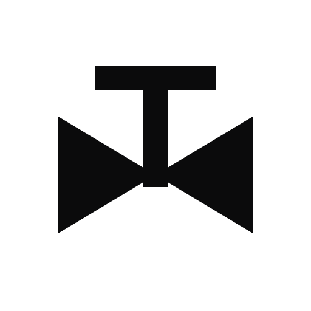
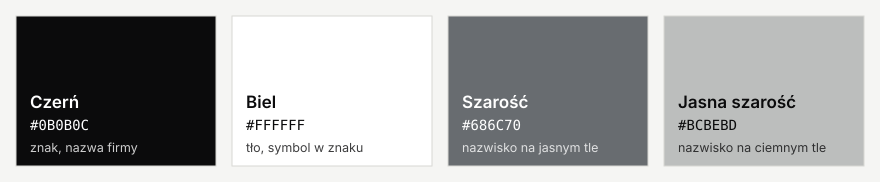
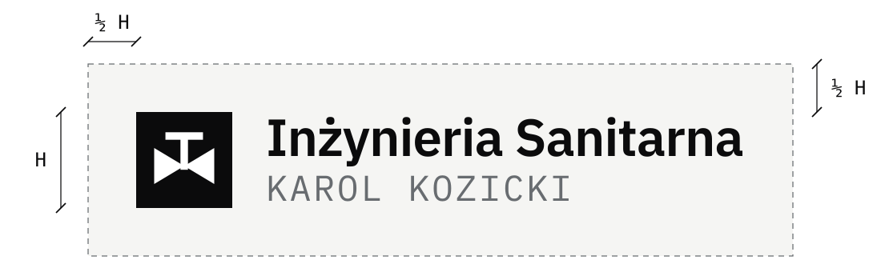

# Logo: Inżynieria Sanitarna Karol Kozicki

	<picture>
		<source media="(prefers-color-scheme: dark)" srcset="logo-odwrocone.svg" />
		
	</picture>

Logo powstało razem ze stroną firmy w październiku 2026 r. Projekt: [Solvy.pl](https://solvy.pl). Firma nie miała wcześniej znaku; jedyna wskazówka brzmiała „czarno-biało".

## Pomysł

Znak to **symbol zaworu z rysunku instalacji**: dwa trójkąty stykające się wierzchołkami, a nad nimi trzpień z pokrętłem. Taki symbol stoi na każdym projekcie wodno-kanalizacyjnym czy grzewczym, więc od razu mówi, czym firma się zajmuje, i łączy obie jej role: projektowanie i wykonawstwo.

Symbol jest biały na czarnym kwadracie. Dzięki temu znak jest czytelny nawet jako ikona 16 × 16 pikseli w karcie przeglądarki.

Obok znaku stoją dwa wiersze:

- **Inżynieria Sanitarna**: nazwa firmy, pismo IBM Plex Sans w odmianie półgrubej.
- **KAROL KOZICKI**: nazwisko właściciela, wersalikami, pismem IBM Plex Mono w szarości. To pismo o stałej szerokości znaków, jak opisy na rysunku technicznym.

## Wersje

| Wersja | Kiedy używać | Podgląd |
| --- | --- | --- |
| Logo podstawowe | Jasne tła: strona, dokumenty, pieczątka, wizytówka |  |
| Logo odwrócone | Ciemne tła |  |
| Znak | Mało miejsca: ikona strony, zdjęcie profilowe, naklejka |  |
| Znak odwrócony | Mało miejsca na ciemnym tle |  |

## Kolory

Logo ma tylko czerń, biel i szarość. Nie ma koloru firmowego.

| Kolor | Zapis | Gdzie |
| --- | --- | --- |
| Czerń | `#0B0B0C` | kwadrat znaku, nazwa firmy |
| Biel | `#FFFFFF` | symbol zaworu, tło |
| Szarość | `#686C70` | nazwisko na jasnym tle |
| Jasna szarość | `#BCBEBD` | nazwisko na ciemnym tle |

W druku jednokolorowym szarość można zastąpić czernią.

## Zasady użycia

- **Pole ochronne.** Wokół logo zostaw wolne miejsce równe co najmniej połowie wysokości znaku. Nie wstawiaj tam tekstu ani innych grafik.
- **Najmniejszy rozmiar.** Pełne logo: wysokość co najmniej 28 pikseli na ekranie albo 10 mm w druku. Poniżej tej wielkości nazwisko przestaje być czytelne, więc użyj samego znaku. Sam znak: co najmniej 16 pikseli albo 5 mm.
- **Tło.** Logo podstawowe na białym lub bardzo jasnym tle, odwrócone na czarnym lub bardzo ciemnym. Na zdjęciu tylko tam, gdzie tło jest spokojne.

Czego nie robić:

- nie zmieniać kolorów ani nie dodawać nowych,
- nie rozciągać, nie pochylać i nie obracać,
- nie dodawać cieni, obrysów ani gradientów,
- nie przepisywać nazwy innym pismem i nie zmieniać układu znaku względem napisu,
- nie zaokrąglać rogów kwadratu.

## Pliki

| Plik | Zawartość | Do czego |
| --- | --- | --- |
| `logo.svg` | Logo podstawowe, wektor | druk, strona, dalsza obróbka |
| `logo.png` | Logo podstawowe, 1520 × 240 px, przezroczyste tło | dokumenty, e-mail |
| `logo-odwrocone.svg` | Logo na ciemne tło, wektor | druk, strona |
| `logo-odwrocone.png` | Logo na ciemne tło, 1520 × 240 px, przezroczyste tło | dokumenty, prezentacje |
| `znak.svg`, `znak.png` | Sam znak, PNG 512 × 512 px | ikony, profile w serwisach |
| `znak-odwrocony.svg`, `znak-odwrocony.png` | Sam znak na ciemne tło | ikony na ciemnym tle |
| `podglad.html` | Wszystkie wersje na jednej stronie | szybki podgląd w przeglądarce |

Pliki SVG są wektorowe: można je powiększać bez utraty jakości i to one powinny trafiać do drukarni. Napis jest w nich zamieniony na krzywe, więc nie trzeba dołączać fontów.

## Gdzie logo jest już użyte

- nagłówek strony (logo podstawowe, w trybie ciemnym odwrócone),
- ikona strony w karcie przeglądarki i na ekranie telefonu (znak),
- obrazek pokazywany przy udostępnianiu linku do strony.

## Dla grafika

Proporcje liczone od wysokości znaku H: odstęp między znakiem a napisem 0,35 H, wysokość pisma nazwy 0,54 H, nazwiska 0,37 H. Nazwa: IBM Plex Sans SemiBold, światło międzyliterowe −15. Nazwisko: IBM Plex Mono Regular, wersaliki, światło +60. Oba pisma są na licencji SIL Open Font License 1.1.
